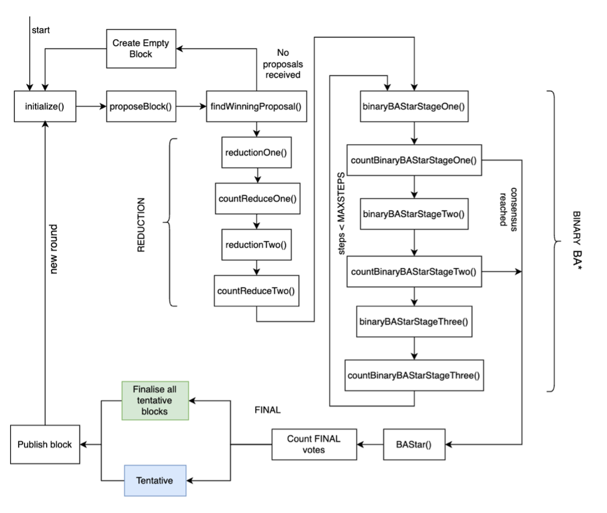

# Algorand-for-SpartanGold

This is a Master's [project](https://scholarworks.sjsu.edu/cgi/viewcontent.cgi?article=2222&context=etd_projects) and part of CS297-298 at San Jose State University.

We have implemented a Pure Proof-of-Stake (PPoS) protocol for SpartanGold by simulating Algorand's Byzantine Agreement protocol and other algorithms.

[SpartanGold](https://link.springer.com/chapter/10.1007/978-3-030-72725-3_9) is a blockchain framework developed by Proj. Thomas Austin. The original [implementation](https://github.com/taustin/spartan-gold) uses a PoW and miners that find proof to win rewards. Our implementation extends the base of SpartanGold to develop a PoS protocol.

[Algorand](https://algorand.com/) is a popular cryptocurrency that employs a PPoS mechanism. The original [whitepaper](https://algorandcom.cdn.prismic.io/algorandcom%2Fa26acb80-b80c-46ff-a1ab-a8121f74f3a3_p51-gilad.pdf) introduced a novel Byzantine Agreement consensus protocol that we have simulated in this project. It also uses VRFs and cryptographic sortition to enable everyone to privately check if they can publish blocks or vote as committee members.

## Running the application

This project works only in a *single-threaded mode*. SpartanGold also runs in a *multi-process mode* using TCP. 

Install all required dependencies as:

``
$ npm install
``

There are 3 driver files that simulate different scenarios:
1. *driver.js* - start the application like a normal blockchain.
2. *driver-partition.js* - simulates network partition where the network gets divided into 2 different groups. Finally, connection is established and all run together and detect a fork.
3. *driver-byz.js* - Byzantine client votes for all received proposals.

To see an example, run driver.js from the command line:

``
$ node driver.js
``

## How parallelism is achieved

Since, JavaScript does not support multi-threaded programming, we needed to develop a logic which would simulate parallel execution. Therefore, we have used `setTimeout()` extensively in the code. When one client switches from one stage to the other, they wait for a fixed time and this waiting switches the second client on the main thread. This repeats for all successive stages and clients.

## Overview of the entire flow

